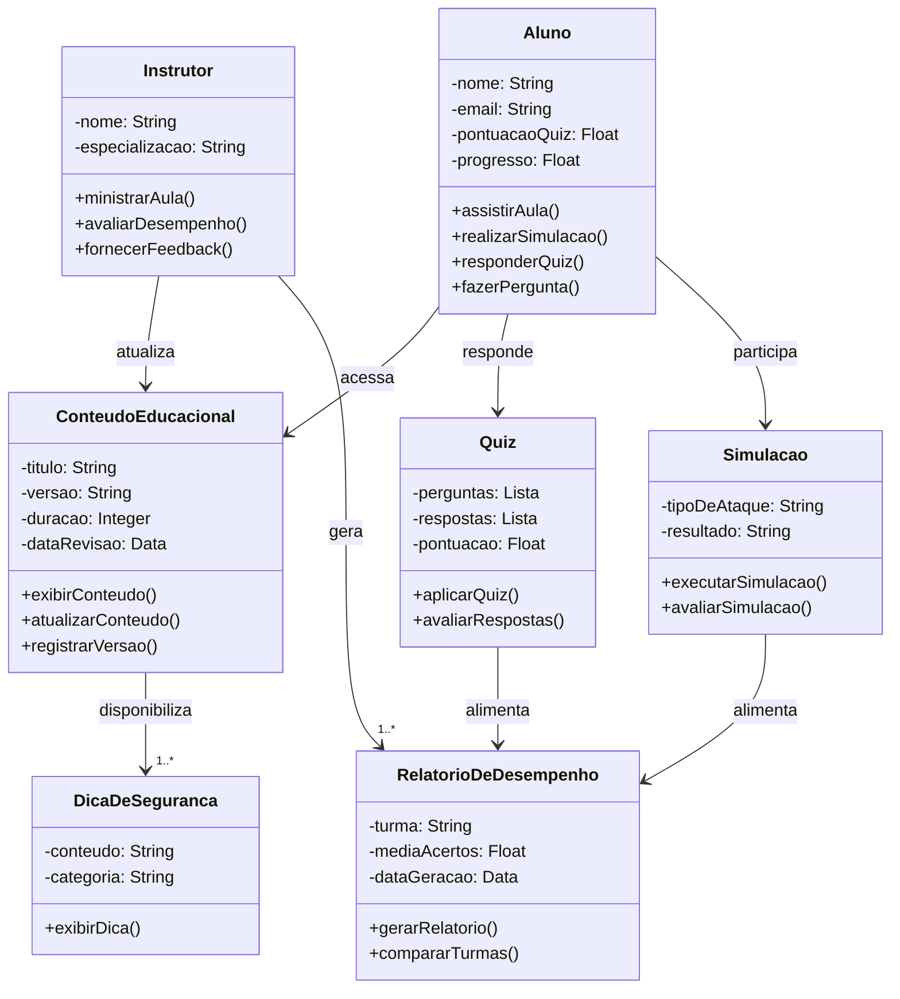

# Diagrama de classes — aula de cibersegurança (atualizado na AE III)

```mermaid
classDiagram
  class Aluno {
    -nome: String
    -email: String
    -pontuacaoQuiz: Float
    -progresso: Float
    +assistirAula()
    +realizarSimulacao()
    +responderQuiz()
    +fazerPergunta()
  }
  class Instrutor {
    -nome: String
    -especializacao: String
    +ministrarAula()
    +avaliarDesempenho()
    +fornecerFeedback()
  }
  class ConteudoEducacional {
    -titulo: String
    -versao: String
    -duracao: Integer
    -dataRevisao: Data
    +exibirConteudo()
    +atualizarConteudo()
    +registrarVersao()
  }
  class Quiz {
    -perguntas: Lista
    -respostas: Lista
    -pontuacao: Float
    +aplicarQuiz()
    +avaliarRespostas()
  }
  class Simulacao {
    -tipoDeAtaque: String
    -resultado: String
    +executarSimulacao()
    +avaliarSimulacao()
  }
  class RelatorioDeDesempenho {
    -turma: String
    -mediaAcertos: Float
    -dataGeracao: Data
    +gerarRelatorio()
    +compararTurmas()
  }
  class DicaDeSeguranca {
    -conteudo: String
    -categoria: String
    +exibirDica()
  }
  Aluno --> ConteudoEducacional : acessa
  Aluno --> Quiz : responde
  Aluno --> Simulacao : participa
  Instrutor --> ConteudoEducacional : atualiza
  Instrutor --> "1..*" RelatorioDeDesempenho : gera
  Quiz --> RelatorioDeDesempenho : alimenta
  Simulacao --> RelatorioDeDesempenho : alimenta
  ConteudoEducacional --> "1..*" DicaDeSeguranca : disponibiliza
```

Mudanças em relação à AE II: `ConteudoEducacional` ganhou `versao` e `dataRevisao`; nova classe `RelatorioDeDesempenho`.
