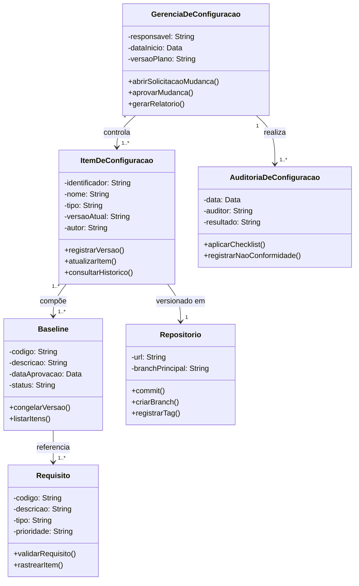

# Diagrama de classes — gerência de configuração

```mermaid
classDiagram
  class GerenciaDeConfiguracao {
    -responsavel: String
    -dataInicio: Data
    -versaoPlano: String
    +abrirSolicitacaoMudanca()
    +aprovarMudanca()
    +gerarRelatorio()
  }
  class ItemDeConfiguracao {
    -identificador: String
    -nome: String
    -tipo: String
    -versaoAtual: String
    -autor: String
    +registrarVersao()
    +atualizarItem()
    +consultarHistorico()
  }
  class Baseline {
    -codigo: String
    -descricao: String
    -dataAprovacao: Data
    -status: String
    +congelarVersao()
    +listarItens()
  }
  class Requisito {
    -codigo: String
    -descricao: String
    -tipo: String
    -prioridade: String
    +validarRequisito()
    +rastrearItem()
  }
  class Repositorio {
    -url: String
    -branchPrincipal: String
    +commit()
    +criarBranch()
    +registrarTag()
  }
  class AuditoriaDeConfiguracao {
    -data: Data
    -auditor: String
    -resultado: String
    +aplicarChecklist()
    +registrarNaoConformidade()
  }
  GerenciaDeConfiguracao "1" --> "1..*" ItemDeConfiguracao : controla
  GerenciaDeConfiguracao "1" --> "1..*" AuditoriaDeConfiguracao : realiza
  ItemDeConfiguracao "1..*" --> "1..*" Baseline : compõe
  Baseline --> "1..*" Requisito : referencia
  ItemDeConfiguracao --> "1" Repositorio : versionado em
```
