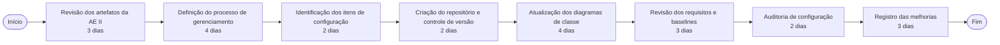

# Diagrama de rede — AE III

```mermaid
flowchart LR
  I([Início]) --> A[Revisão dos artefatos da AE II<br/>3 dias]
  A --> B[Definição do processo de gerenciamento<br/>4 dias]
  B --> C[Identificação dos itens de configuração<br/>2 dias]
  C --> D[Criação do repositório e controle de versão<br/>2 dias]
  D --> E[Atualização dos diagramas de classe<br/>4 dias]
  E --> F[Revisão dos requisitos e baselines<br/>3 dias]
  F --> G[Auditoria de configuração<br/>2 dias]
  G --> H[Registro das melhorias<br/>3 dias]
  H --> Z([Fim])
```
